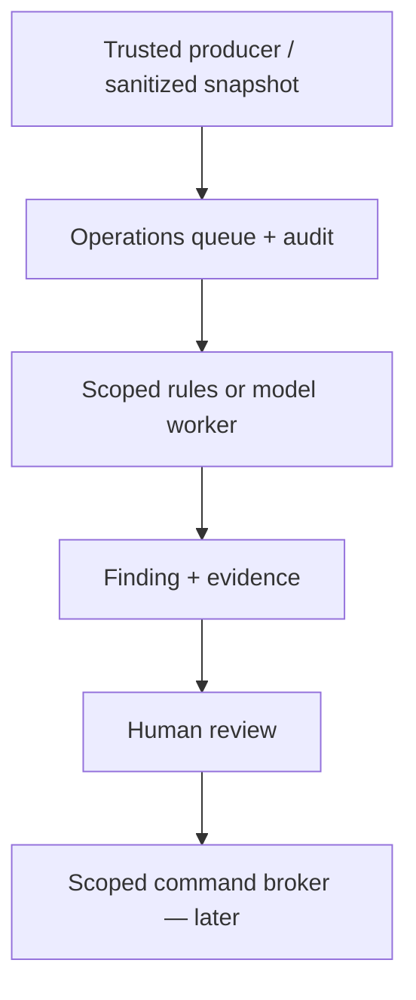

# GoBookr AI Operations — audit and Phase 1

Audit date: 2026-10-06 UTC / 2026-10-05 Denver.
Audited main: e796c08aaacbcd84d87c92a673c689dc7aae83fc; GitHub compare confirmed main identical.
This is an implementation foundation and operating proposal, not a claim that GoBookr is ready for 250,000 subscriptions or can already operate with ten humans.

## A. Existing infrastructure

| Capability | Evidence in audited code | Reuse / limit |
|---|---|---|
| Node HTTP/custom router on Vercel | server.js, lib/router.js | Keep public routes unchanged; run operations separately. |
| Supabase Postgres compatibility layer | db/index.js, db/postgres-worker.js | Dedicated worker thread exposes synchronous calls; existing snapshots read entire tables. Do not reuse broad database credentials or this blocking interface for new operations. |
| Admin grants + fresh session authorization | lib/admin.js | Checks public.admin_accounts and unexpired session on each request, bypassing caches. Reuse for a later approval UI. |
| Claims and transactional approvals | routes/admin.js, routes/claim.js | Useful case states; ownership is a human decision. |
| Subscription state + signed Stripe webhooks | routes/billing.js, lib/stripe.js, lib/subscription.js | 30-day trial, $20 price validation, grace-state rules. Signature verified; no durable event-ID receipt/outbox found in the inspected handler. Add before lifecycle fan-out. |
| Provenance and importer | scripts/import-unclaimed-profiles.js | Normalize/dedupe public candidates; source fields provide evidence pointers. Script idempotency is not a general job queue. |
| Marketing drafts, schedules, openings and story assets | routes/pro.js, marketing migrations | Scheduling stores state; this does not prove social delivery. Keep manual download/post when integrations are not verified. |
| Profile views / booking activity | routes/pro.js, pro_events migrations, server.js | Useful aggregates; measurement coverage must be verified before CEO reports rely on it. |
| CI syntax, automated tests and import audits | .github/workflows/check.yml | Extend regression gates. Existing tests do not replace signed-in mobile/desktop acceptance. |
| License evidence work, unmerged | PR136, lib/profile-polish.js | Active license/identity/evidence/expiry gates and review/revoke tests. Not deployed proof; integrate after its release gates clear. |

## B. Missing infrastructure and current launch gaps

1. Durable operations queue, leases, dedupe, bounded retries, dead-letter handling, replay and health checks.
2. Restricted operational database identity, sanitized projection/export service, domain-command broker and transactional outbox.
3. Case management, evidence provenance, immutable recommendation versions, authenticated approvals, escalation ownership and response SLAs.
4. Approved support knowledge base with versioning, authenticated account lookup, helpdesk integration and evaluations.
5. Production email sender, deliverability, unsubscribe/consent controls, idempotent delivery receipts. routes/auth.js currently creates a reset token and contains a production-delivery TODO while returning a sent-instructions message: this is a launch blocker to investigate independently.
6. Provider adapters, structured-output validation, request persistence, timeout/circuit-breaker policy, per-professional/global budget reservations and usage reconciliation.
7. Distributed rate limits. lib/rate-limit.js uses an in-process Map, which is not a platform-wide limit across serverless instances.
8. Confirmed external social integrations, registry access methods and licenses/terms for use of third-party data.
9. Operational metrics, alerting, dependency health, alert routing, privacy retention jobs, disaster recovery and load-test evidence.
10. Scalable discovery/data access: full-table snapshots and sitemap limits of 5,000 per group in server.js need separate scale work; do not couple that refactor to Phase 1.

This audit inspects code, not provider dashboards or all live configuration. No live Stripe/registry/social/email capability is certified by this document.

## C. Five highest-ROI automations

These are engineering priorities inferred from existing capabilities; no measured labor savings have been fabricated.

| Order | Automation | First output | Success measure |
|---|---|---|---|
| 1 | Rules-first profile quality | Missing fields, stale provenance, duplicate candidates and booking-link check observations for review | Precision of flags, reviewer time, reduction in unusable listings |
| 2 | Grounded support triage | Draft answers from an approved FAQ, citations, reason for escalation | Correctness on held-out cases, resolution rate and reopen rate |
| 3 | Onboarding assistance | Missing-field checklist, owner-confirmed description/category drafts | Time to completion, completion rate, correction rate |
| 4 | Billing operations explanations | Deterministic trial/past-due/cancel state explanations and approved reminders | Delivery accuracy, repeated questions, no duplicate sends |
| 5 | Daily operations briefing | Rules-computed counts and anomalies; optional model narrative linked to evidence | Actionable issues, no fabricated counts, alert-to-resolution time |

Start #1 using existing verified observations; a failed URL check alone must not remove a profile or replace a booking destination.

## Modular architecture and permissions

Use typed producers -> sanitized event/outbox -> durable queue -> isolated worker -> finding/case -> human approval -> narrowly scoped command executor.
The model never receives SQL, database credentials, payment keys or a general-purpose execution tool.

Phase 1 contains B–E as library/storage contracts plus one rules worker calculation. Producers, scheduled execution, review UI and command broker are NOT connected.

| Module / job family | Allowed observation / output | Required human boundary |
|---|---|---|
| Support | Approved KB + authorized account-state projection; cited reply draft | Security recovery, disputes, legal requests, threats, unclear identity |
| Onboarding | Owner-provided fields; checklist and proposed wording/categories | Claim/ownership and owner acceptance of changed public facts |
| Data quality | Public factual projections, source dates and URL-check codes; findings | Merge/delete, address/identity/booking destination changes |
| Trust & safety | Case-bound evidence and abuse signals; evidence summary | Ban, restriction, ownership denial/transfer; no theft conclusion from similarity alone |
| Licenses | Registry observation + existing evidence; match/expiry flags | Grant/revoke badge, uncertain matches, unsupported registry access |
| Marketing | Pro-owned assets and approved lifecycle templates; draft/schedule | Professional approval, consent, confirmed delivery integration |
| SEO | Real eligible profiles and approved templates; useful populated discovery pages | Editorial review for model content; no invented facts or empty/thin pages |
| Billing | Verified subscription-state projection; explanation/reminder proposal | Refund, charge, credit, plan changes, dispute decisions; Stripe remains state authority |
| Briefing | Aggregate counts and case IDs; narrative with query/window references | CEO decides policy/resources; never infer revenue from profile count |
| Engineering | Logs scrubbed of secrets, CI results; proposed patch/repro | High-risk changes, secrets/auth/DNS, production data operations/deployments |

All ten modules are named in the policy registry. Only data_quality.snapshot.v1 is executable. Unknown/disabled job names fail closed. Phase 1 permissions are read_sanitized_snapshot and record_findings only. Approval records do not execute anything.

## D. Control, confidence and escalation

- Consequential decisions always require human approval, regardless of confidence.
- Confidence is calibrated against labeled evaluation data, not a model's self-reported number.
- Proposed later thresholds: >=0.98 for eligible reversible normalization with deterministic verification; 0.80–0.98 review; <0.80 request evidence. Thresholds are starting hypotheses, NOT enabled in Phase 1.
- Phase 1 confidence=1 means a supplied bounded observation is present (e.g., missing field), not that an address is wrong or a profile should be changed. Every finding starts pending.
- Approval includes expected snapshot hash; future execution must also re-read domain version, re-check human role/session, validate proposed fields and record before/after plus rollback plan.
- No profile merges, deletes, ownership changes, license badges, Stripe mutations, outbound communications or code deployment is reachable from the Phase 1 module.
- Escalation routing later: security/impersonation immediate; money/ownership/license by trust lead; unresolved FAQ to support; outages to engineering. Set staffing/on-call SLAs before automated replies.

## Privacy and security

- Separate operations database preferred, with a restricted schema and dedicated async pg Pool; do not inject db/index.js or a production superuser connection.
- Producers export exact allowlisted fields only. Phase 1 accepts profile_id, enumerated missing_fields, booking_status and bounded source_age_days. Extra keys fail; no name, email, password, license number, URL, address or free text is accepted.
- Phase 1 makes no external network/model calls. Provider abstraction is currently a rules adapter plus a documented interface, not a working hosted-model integration.
- Treat tickets, web pages, descriptions and model output as untrusted data, never instructions or permission.
- Future providers need approved data-processing/retention settings and redaction tests. Keep raw support messages in the helpdesk, not the generic job ledger; IDs can still be personal data.
- Store structured findings and audit event codes instead of prompts/error dumps. Production retention target: job snapshots/results 30 days, redacted events/usage 12 months; implement retention before activation and preserve lawful case holds through a separate process.
- schema.sql is in an unexposed ai_ops schema, enables RLS, revokes PUBLIC access and grants no roles/policies. It is deliberately NOT in the migration runner. Restricted role provisioning/policy review is a release gate, not implemented by pretending a shared app credential is safe.
- Events are append-only through this library API, not cryptographically tamper-proof. Dedicated audit-writer privileges should allow INSERT/SELECT only; database owners retain administrative power.

## Scale and reliability

- Use one event per meaningful change, not an LLM scan of every profile every day. Periodic keyset scans of <=500 records supplement outbox events.
- Use idempotency keys including module, entity and source version; conflicting reuse rejects instead of silently reprocessing different data.
- Workers use async connections and FOR UPDATE SKIP LOCKED, 60-second lease tokens and maximum three attempts. Stale tokens cannot complete/retry. Expired final attempts move to dead; reaping is bounded at 100 rows.
- Start 1–2 workers; add separate queues/concurrency/provider budgets per module after load testing. Monitor oldest job age, lease expiry, dead count, reviewer backlog, cost and approved-change reversals.
- Outbound URL check service needs allowlisted providers, DNS/IP/private-network protections, redirect revalidation, timeouts, rate limits and retry observations; never let model-picked URLs drive arbitrary fetches.
- Reserve global, module and professional monthly spend atomically BEFORE any future provider call; reconcile billed usage afterward; unknown outcome stays reserved until reconciliation. Persist generation ID before the call, provider/model/version/rate snapshot and tokens/cost after. Phase 1 paid providers are disabled, so spend is exactly zero.
- Pool-level concurrency, failure injection, large-table query plans and load tests remain required. PGlite tests verify SQL behavior on a serialized connection, not multi-connection production performance.
- At 250,000 pros, 20 simple + 2 complex calls/month means 5.5M calls/month, about 2.1/s average before peak bursts. Event throughput and millions of consumer interactions must be capacity-tested separately.

## E. Phased roadmap

| Phase | Deliverable | Exit gate |
|---|---|---|
| 1 — now | Dormant queue, lease fencing, dedupe, audit/findings, human-review contract, $0 rules adapter and per-pro usage ledger | Unit/SQL tests, green CI, no route/UI changes, reviewed PR; no activation |
| 1b — first operational pilot | Dedicated preview operations DB/roles, producer projection, read-only quality pilot, admin review UI and retention | Permission-denial tests, mobile/desktop UI checks, failure/load tests, no production mutations |
| 2 | KB support drafts, onboarding checklist, real email-delivery integration and deterministic billing explanations | Evaluations, consent/delivery receipts, authenticated state lookups, zero cross-account disclosures |
| 3 | Trust/license case summaries, duplicate candidates, marketing drafts and evidence-linked CEO briefing | Human approval workflow, domain version checks, operating SLAs, measured reviewer precision |
| 4 | Carefully bounded reversible actions, populated SEO maintenance, proactive alerts | Calibrated thresholds, rollback/reconciliation, automated action limits and audited production rollout |
| 5 | Scale-out, provider routing, cost optimization, engineering regression detection | 100k/250k load tests, disaster recovery drills, sustained cost and escalation targets |

Current launch priorities (including PR136 profile acceptance and billing/email QA) remain independent. No new public AI buttons or site redesign.

Ten-human planning model: CEO/operations 1, engineering/reliability 3, trust/license operations 2, support/customer success 2, growth/content 1, finance/vendor operations 1. At 250k pros, 1% requiring a ten-minute human review/month already means ~417 review hours/month; 5% means ~2,083 hours. Ten humans is a goal contingent on measured escalation volume, quality and contractors/on-call coverage, not a guaranteed staffing result.

## F. Monthly AI/API cost scenarios

Planning assumptions verified against vendor pricing on 2026-10-06:
- Simple text call: Claude Haiku 4.5 at $1/M input + $5/M output, 2,000 input + 600 output tokens = $0.005.
- Complex text call: Claude Sonnet 5.5 at $2/M input + $10/M output, same token volume = $0.010.
- Lean: 4 simple calls/pro/month. Standard: 20 simple + 2 complex. Heavy: 60 simple + 6 complex.
- Add 30% reserve for retries/evaluations and $50/month platform-level briefing/evaluations. No caching/batch discount assumed; no contractual quote.

Sources: https://platform.claude.com/docs/en/about-claude/pricing
Provider comparison: https://developers.openai.com/api/docs/pricing
Model selection must be revalidated at activation; model pricing/availability changes.

| Paying pros | Lean | Standard | Heavy |
|---:|---:|---:|---:|
| 1,000 | $76 | $206 | $518 |
| 10,000 | $310 | $1,610 | $4,730 |
| 100,000 | $2,650 | $15,650 | $46,850 |
| 250,000 | $6,550 | $39,050 | $117,050 |

Variable per-pro costs: $0.026 / $0.156 / $0.468 per month, plus the shared $50. At the standard 250k scenario, $39,050 is ~0.78% of $5M gross monthly subscription revenue before all other costs. These are hypotheses, not measured GoBookr usage.

EXCLUDED: database/queue/hosting/storage, helpdesk, email/SMS, Stripe fees, third-party registry/search/verification APIs, image/video/audio generation, salaries and taxes. Consumer support scales independently: 5M consumers x 0.5% monthly support-contact rate x 4 simple calls = 100k additional calls, ~$650 including the 30% reserve. Higher contact rates change this materially.

## Phase 1 acceptance and rollout

- New files only: lib/ai-ops/policy.js, lib/ai-ops/store.js, db/ai-ops/schema.sql, tests/ai-ops.test.js, this document.
- No server import, route, stylesheet, billing flow, secret or production data change.
- Tests use a disposable embedded Postgres instance and non-public internal fixtures. Unknown fields/jobs, conflict dedupe, RLS denial, lease fencing, retry exhaustion, approval denial/staleness, audit events, $0 usage and unchanged domain sentinel are covered.
- No schema installed on preview or production. No scheduler connected. No model provider configured. No email/social actions performed.
- A future activation PR must add restricted DB provisioning, producer auth/projection, role/policy denial tests, retention, a signed-in admin review UI, operational alerting and documented rollback before any live pilot.
- Backout now: revert these unreferenced files. Once activated later: stop producers/workers with kill switches; preserve audit/evidence and pending cases.
