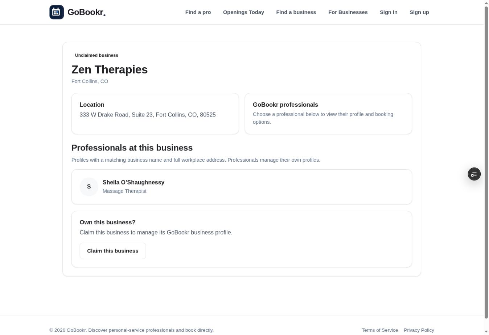
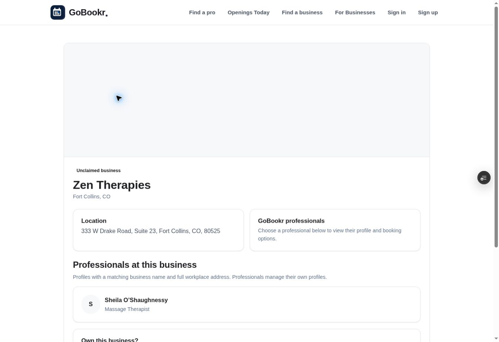
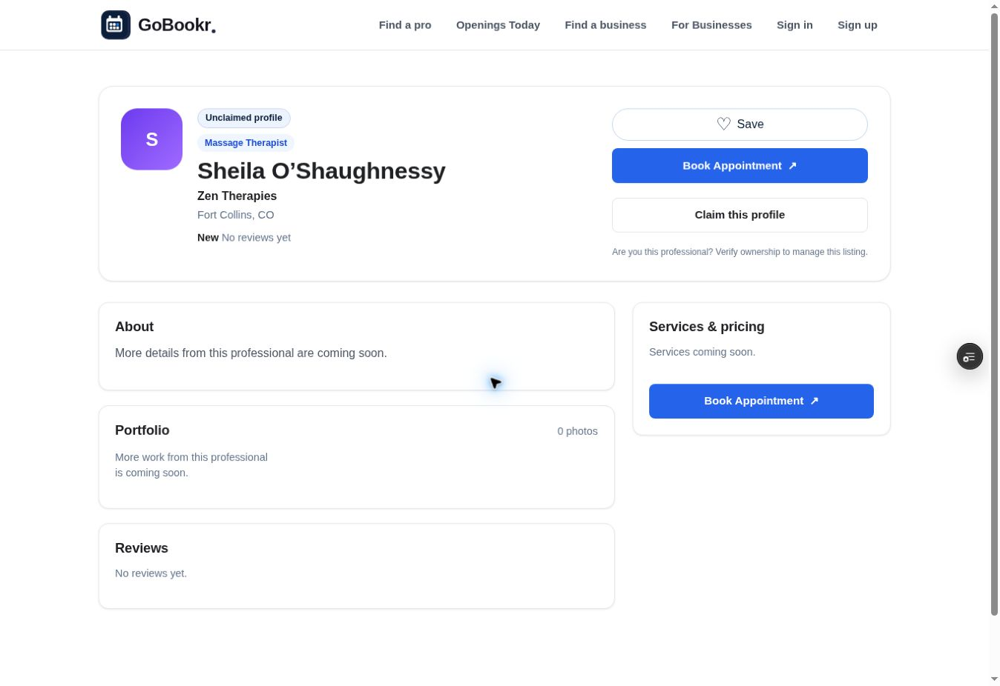
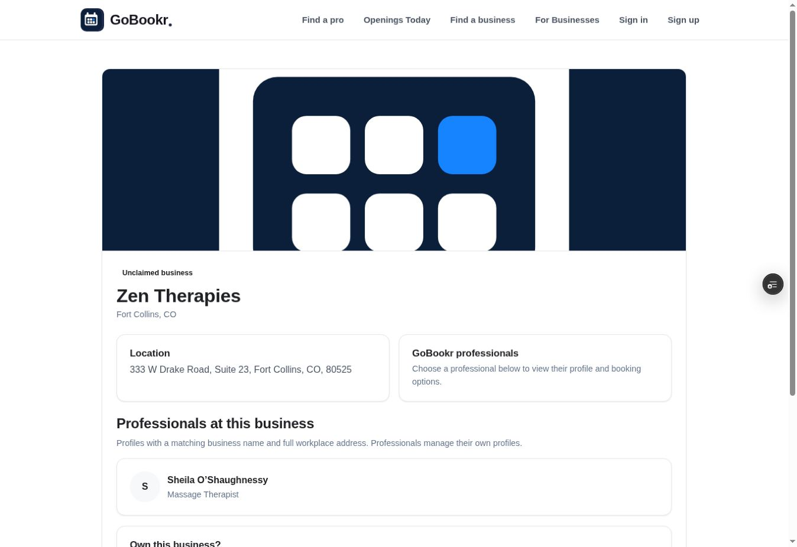
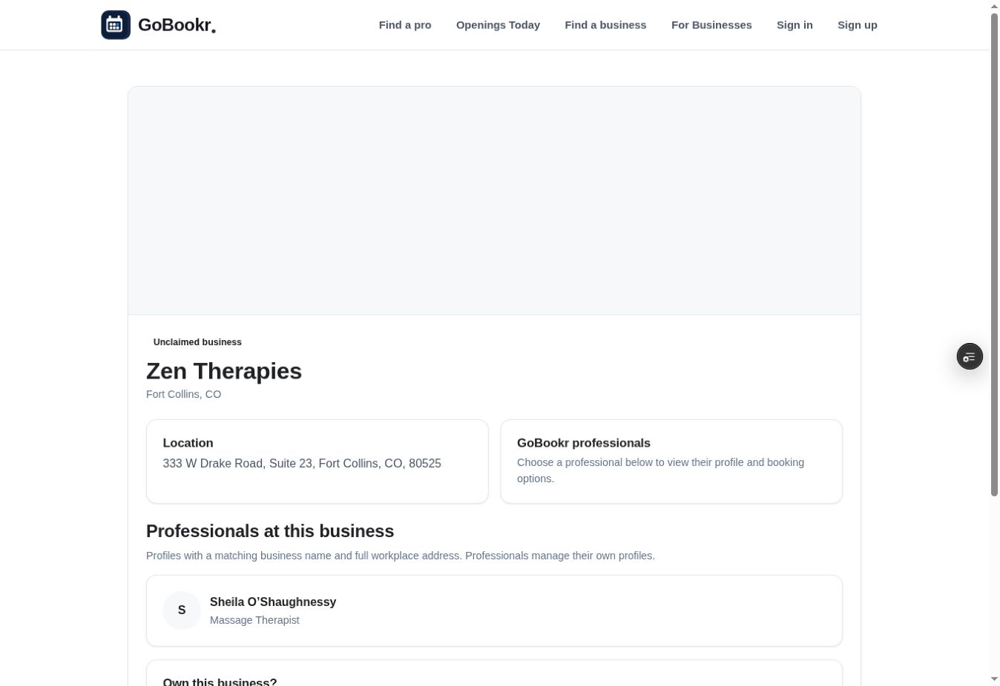

# Profile polish acceptance log

PR: https://github.com/mattmedina4224-create/Gobookr/pull/136

## Implemented

- Business banners crop consistently, use a neutral fallback when absent or invalid, and fall back after an image load error. Owner settings provide a banner URL editor and saved preview; this does not add file uploading.
- Staff membership matches business name, city, state, street, ZIP and suite. Incomplete addresses and other branches do not match. A professional links back to a uniquely matching public business; ambiguous matches remain unlinked.
- License badges require a recorded registry review matching the current professional name, license number and state, an active status, confirmed identity, reviewer, source URL and future expiration. Legacy flags alone cannot display a badge. Name/license changes invalidate verification. Admins can record or revoke a review.

## Evidence

- Full automated suite after removing the unsuccessful preview viewport helper: 215 passed, 0 failed, 0 skipped (2026-10-05). Includes real disposable Postgres tests for matching, owner-only edits, admin permissions, review validation and revocation. Test identities never entered production or the shared preview database.
- Preview HTTP GET /shop/1 returned 200, with Zen Therapies, its exact workplace address, a neutral banner, and Sheila O’Shaughnessy linked at /pro/522; no verified-license badge was rendered.
- Nullable license_verification JSONB column added idempotently to isolated preview and production. No existing profile values, owners or booking links were modified. Production query after migration: 501 profile rows, 0 verified flags, 0 recorded reviews. These are database row counts, not a certified count of legitimate public listings.
- One real business was added only to the isolated preview using the existing professional's attributed workplace fields. No invented business, address, photo or license was published.
- First application commit 3f8bb8b passed GitHub checks. Later viewport-helper commit 8de65a7 failed server-harness tests; the helper and server hook were removed. Full local suite passed again. Latest remote checks must be checked separately.

## Outstanding acceptance / blockers

- Mobile and desktop browser acceptance remains incomplete: the browser navigation timed out. HTTP output and automated route tests do not establish visual acceptance.
- Preview owner/admin accounts are not available for signed-in browser tests. Owner edits and admin reviews have automated route/database evidence, but not mobile/desktop browser evidence.
- Uploaded/loaded and broken-photo appearance still need browser screenshots; no before/after screenshots are claimed.
- No actual professional license was verified in this work. Real registry review remains an authorized admin task.
- PR must not be merged until required preview/mobile/desktop acceptance and current checks pass.

## Follow-up verification

- Commit fd2b4c passed GitHub run 774 and its Vercel preview reached READY.
- Browser recovered. Desktop staff link /shop/1 -> /pro/522 and professional backlink -> /shop/1 both passed on that preview. No license badge was displayed for this unverified professional.
- Browser inspection found the business fallback had zero height because the stylesheet change was incomplete. Fixed by restoring the complete baseline stylesheet and appending the scoped banner rules.
- Corrected commit c40564b passed GitHub run 775. Browser reopened its Vercel preview successfully. Fallback measured 311.875px high with neutral rgb(247,248,250) background; viewport width 1363px and document scroll width 1348px (no horizontal overflow).
- Screenshots below are desktop evidence only; the first image shows the discovered bug before correction, not a production baseline. Mobile, signed-in owner/admin, loaded-photo and broken-photo browser acceptance remain outstanding. This supersedes the earlier browser-timeout status for desktop public pages.

The existing production design is unchanged by this open PR. Only the additive nullable database column has reached production.

## Banner image acceptance, 2026-10-05

- Latest evidence commit e8764e0 passed GitHub run 776; deployment dpl_2Mexqu9itfnkr3fFhonmgpWGo1wo READY.
- Isolated preview shop 1 temporarily used GoBookr's own favicon SVG solely as a QA image (not a business photo). Browser confirmed complete=true, naturalWidth=150, naturalHeight=150, hidden=false, object-fit=cover, rendered 998 x 310.875px. This establishes loaded-image rendering on desktop, not photo upload acceptance.
- Temporary missing asset URL tested a real network/image failure. After the 30-second database read cache expired, the browser confirmed complete=true, naturalWidth=0, hidden=true, display=none; banner had business-banner--fallback, aria-hidden=true and retained height 311.875px. No broken-image icon remained visible.
- Restored preview cover_url to its original empty string; SQL UPDATE RETURNING confirmed id 1 and cover_url="". No production data changed.
- Preview users count: 0. Signed-in owner/admin browser acceptance remains blocked. Mobile acceptance remains incomplete; the available browser API does not expose viewport resizing. Neither desktop screenshots nor automated route tests certify mobile.

## Preview account setup

User explicitly approved preview-only admin access on 2026-10-05. Inserted admin_accounts grant for preview user 2 idempotently; fresh SQL JOIN confirmed grant at 2026-10-05 03:33:17.642217+00. Account role remains customer; no business ownership or professional profile was assigned. No production account, auth-provider setting, password or secret changed. Signed-in browser acceptance still requires the user's preview session and is not certified by this database grant.
